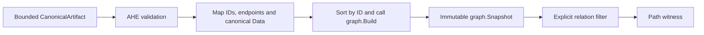
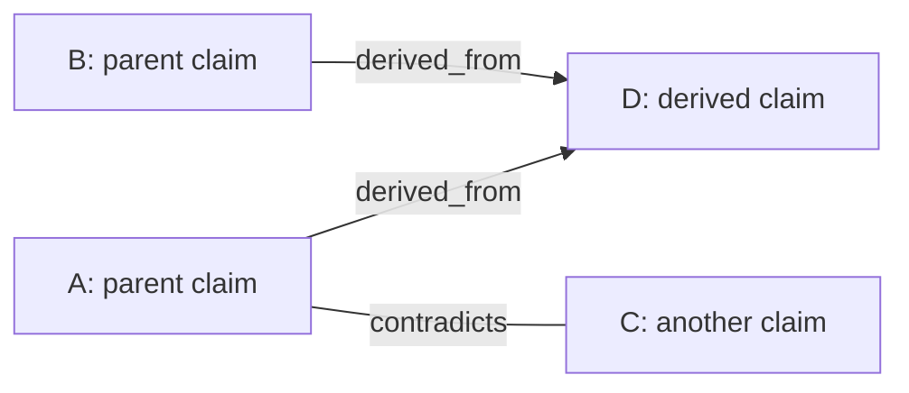
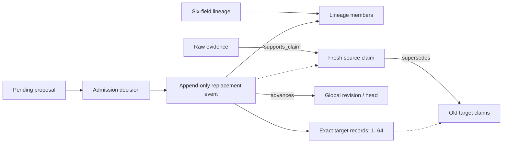
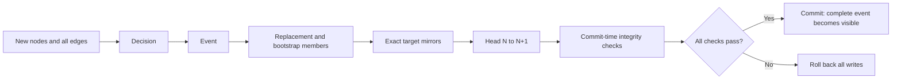
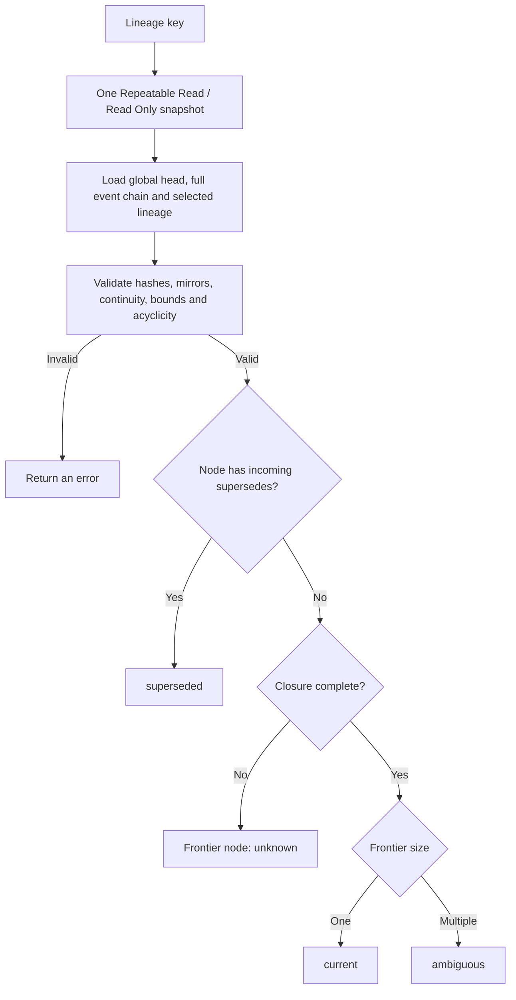
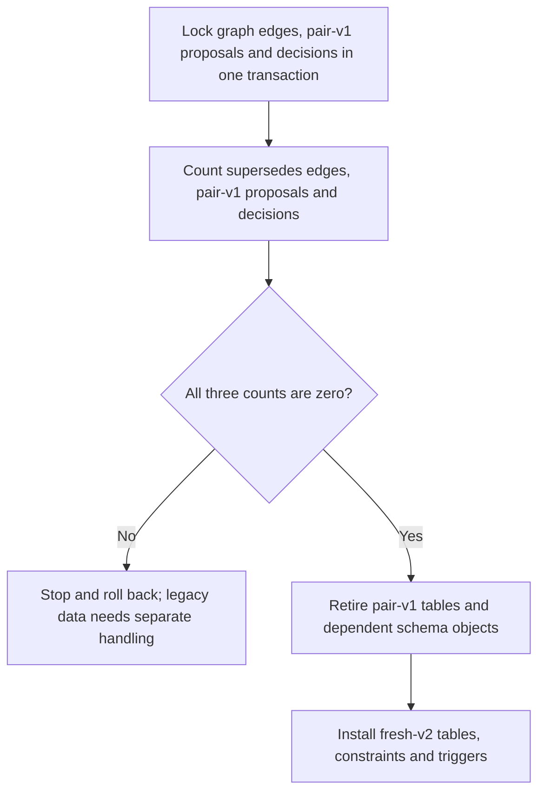

# AHE System Design

This document describes current data structures, algorithms and theoretical boundaries.
See [INSTALL](../INSTALL.md) for installation and permissions, and [README](../README.md)
for product entry points. It describes product contracts; internal plans and experiment
progress are not current capabilities. Historical experiment logs, reviews and raw
measurements are not product documentation. This document is not proof of deployment
readiness or model quality.

**Status: Desktop has been frozen and unavailable since 2026-09-14.** Desktop UI and
Service descriptions refer to retained code, not a working or complete workflow.
CLI completion and acceptance come first. The freeze does not change MCP/Core query
algorithms, data structures or admission boundaries.

## Contents

- [System responsibilities](#architecture)
- [Data model and identity](#data-model)
- [Review and state transitions](#review)
- [Graph relations and versions](#graph)
- [Text search](#search)
- [Detective extraction and recovery](#detective)
- [Runtime authority and integrity](#authority)
- [References](#references)

<a id="architecture"></a>

## System responsibilities

```text
Data source / source MCP → Detective → Intake MCP → sources, extraction records, pending
                                           ↓
                             exact review subject → human decision
                                           ↓
                                    Review MCP → PostgreSQL
                                           ↑
Detective / downstream agent ← read-only evidence package ← Query MCP
```

- **Detective** connects to sources, preserves original content, runs model extraction
  and provides the human workflow. Source collection stays outside Core.
- **MCP domain / PostgreSQL** stores source identity, proposals, review decisions and
  the canonical graph. Model output does not authorize writes.
- **Query** retrieves material with scope, status and citations. It does not produce
  factual conclusions for the user.
- **Topology kernel** handles nodes, edges and structural algorithms. AHE defines
  the evidence meaning, temporal semantics and admission rules of relations.

Detective and MCP share one Go module but communicate through separate stdio processes.
The new Desktop does not hold DB credentials directly; the old `ahe-detective` collector
is a separate program. Collected sources, pending proposals, admitted canonical evidence,
active repository generations and downstream answers are five distinct states or layers.

<a id="data-model"></a>

## Data model and identity

### Sources and candidates

| Structure | Stores | Does not establish |
| --- | --- | --- |
| `source_blobs` | Original content and content hashes | Source truth or trustworthiness |
| `source_snapshots` | Source objects, revisions and metadata | Whether a revision is still the latest at the provider |
| `extraction_views` | Renderer/version, rendered body and hash | Permission to replace original content with a model summary |
| `span_catalog_entries` | Exact byte ranges, line numbers, citations and hashes within a view | Support for arbitrary claims |
| `extraction_runs` / `extraction_attempts` | Source, extractor definition, attempt status and output identity | Acceptable model semantic quality |
| `proposal_batches` / `proposal_occurrences` | Candidate sets from one output and their claims | Admission approval |
| External source request/receipt | Binding between a delivery and its stored source | Independent sources merely because there were multiple deliveries |

Raw bytes, rendered views, exact quotes and claims are stored separately. Cleaning or
rendering must retain the renderer and source relationship; a model summary must not
overwrite original evidence. Multiple quotes from one document are not automatically
independent support.

External sources use provider object identity and revision. Content or source metadata
changes under the same revision cause a conflict. The external envelope requires
`content_fidelity=verbatim`. `exact_excerpt` and `truncated_document` require stated
limitations; `full_document` requires empty `limitations`. This submission contract does
not externally certify provider identity or completeness.

Source delivery requests and extraction requests use separate namespaces. Reusing an
extraction request requires the same source, view and extractor definition. Different
inputs require a new request. Identical output can be replayed; changed output cannot
append another candidate set. `producer_session_ref` is an audit annotation, not a
replacement for semantic identity. A successful output with zero candidates is abstention.
A late failure can only move `started` to `failed`; it cannot overwrite a committed terminal state.

### Canonical graph

`CanonicalArtifact` is a portable, bounded representation containing nodes, edges,
payloads, provenance, temporal data, integrity and derivations. It is not another
authoritative persistent database.

- Node kinds: `raw_evidence`, `source_claim`, `derived_claim`, `candidate`.
- Edges contain `from`, `to`, a relation and a provenance reference.
- Payloads separately retain source content/location, claims, scope and target anchors.
  A title is not complete evidence.
- Temporal records and Supersession currentness differ. Currentness is a projection
  computed at query time.
- A derivation records the complete parent set as an **AND dependency**; one parent
  alone is not sufficient.

The existence of a type does not mean a standard MCP writer can create it.
See [canonical.go](../internal/evidencegraph/canonical.go) for types,
[external_source.go](../internal/evidenceingestion/external_source.go) for source
contracts, and [migrations](../migrations) for persistence constraints.

<a id="review"></a>

## Review and state transitions

| Human decision | Stored result | Canonical effect |
| --- | --- | --- |
| Defer | Remains `pending`; not a writer outcome | None |
| `admit` | `admitted` decision and exact-review binding | Atomically creates or verifies canonical materialization eligible for reuse |
| `reject` | `rejected` terminal state and review reason | No canonical nodes or edges created |
| `audit_only` | `audit_only` terminal state and review reason | No canonical nodes or edges created |

The exact-review binding chain is manifest → submission receipt → proposal basis →
review package → displayed subject. The displayed text is bound too; checking only a
proposal ID is insufficient. The review getter accepts only pending proposals. In one
Repeatable Read transaction, the writer locks the proposal, rebuilds the subject and
checks the complete display before atomically storing the decision and any corresponding
materialization. Seeing a review package grants no approval authority to Intake, Query or a model.

Replay must preserve the original outcome, subject, extraction attempt, principal and
reason. Changing a reason, quote or ID is not recovery. An uncertain response does not
mean the remote transaction rolled back. Terminal-state retries use the original writer
request and do not require a new pending review.

Ordinary source-backed admission creates `raw_evidence → source_claim` through
`supports_claim`. The mutation manifest, node/edge binding and first-materializer identity
constrain reuse and exact replay. Different content or relations under the same ID must
be rejected rather than overwrite existing evidence. The DB records who admitted a claim
and why; it does not prove that the person read the display or that the claim is true.

Implementation: [review contract](../internal/evidenceingestion/reviewable_ingestion.go),
[display binding](../internal/evidenceingestion/reviewable_ingestion_display.go),
[admission](../internal/evidenceingestion/reviewable_ingestion_admission.go),
[disposition](../internal/evidenceingestion/reviewable_ingestion_disposition.go).

<a id="graph"></a>

## Graph relations and versions

### Structural algorithms are not evidence inference

| Relation | Meaning/direction |
| --- | --- |
| `supports_claim` | Raw evidence → source claim |
| `derived_from` | In this implementation, parent → derived target; the complete parent manifest expresses the AND dependency |
| `contradicts` | Symmetric; sorted endpoints identify the same node pair |
| `supersedes` | New replacement → old target |
| `references` / `implements` | Typed reference/implementation relations; similarity or arbitrary edge writes alone cannot establish them |

The graph adapter obtains AHE-selected relations and a bounded scope from one read
snapshot, then passes them to general topology algorithms. A path proves only structural
connectivity within that view. A cycle, SCC or contradiction component does not automatically
prove a semantic contradiction, nor that every pair in the component contradicts each other.
Checks requiring a DAG must name the relation; the full evidence graph is not assumed acyclic.
Process-local read-view handles bind the principal and DB/schema/role. They must be reopened
after eviction or process restart. A bounded ReadView is not a complete global graph.

### Graph adapter example

The adapter maps AHE records to the generic graph kernel without changing their IDs
or relations. It sorts nodes and edges by ID, then calls `graph.Build` to create a
snapshot. Canonical records remain in each graph node/edge's `Data` field. The relation
filter is applied when an algorithm reads that snapshot.



For example, suppose a complete artifact contains these synthetic relations:



The following helper runs inside this repository's Go module because it imports
`internal` packages. Its input is a complete `CanonicalArtifact`, including the
payload, provenance, temporal, integrity and derivation records required by validation.
An edge-only diagram is not enough to construct that artifact. A bounded PostgreSQL
read supplies `CanonicalReadView.Artifact`; its scope and `Truncated` flag must remain
part of the caller's interpretation.

```go
package graphexample

import (
	"github.com/Yui-Qi-Tang/ahe-mcp/internal/evidencegraph"
	"github.com/Yui-Qi-Tang/ahe-mcp/internal/evidenceprojection"
)

// FindDerivedPath finds one directed path using only derived_from edges.
func FindDerivedPath(
	artifact evidencegraph.CanonicalArtifact,
	from, to string,
) (evidenceprojection.PathWitness, error) {
	topology, err := evidenceprojection.PrepareTopology(artifact)
	if err != nil {
		return evidenceprojection.PathWitness{}, err
	}
	return topology.FindPath(evidenceprojection.PathQuery{
		FromNodeID: from,
		ToNodeID:   to,
		Relations: []evidencegraph.CanonicalEdgeRelation{
			evidencegraph.CanonicalDerivedFrom,
		},
	})
}
```

| Query in this example | Result |
| --- | --- |
| A to D, `derived_from` only | `Found=true`, path A → D |
| A to C, `derived_from` only | `Found=false`; the contradiction edge is excluded |
| D to A, `derived_from` only | `Found=false`; derived edges keep their direction |
| A to C, `contradicts` only | `Found=true`; use `CanonicalContradicts` in `Relations` |

The A → D path does not establish that A alone supports D: D's complete derivation
still requires both A and B. The witness reports connectivity within this view and
does not admit evidence or change PostgreSQL. The adapter and `graph` types remain
private to `evidenceprojection`; callers use AHE's `PreparedTopology` and `PathWitness`.
See [adapter](../internal/evidenceprojection/topology.go),
[path API](../internal/evidenceprojection/topology_algorithms.go) and
[relation-scope tests](../internal/evidenceprojection/topology_algorithms_test.go).

### Implemented internal domain contracts

These write paths exist in the domain/typed registry, but **the current standard ingestion
runtime does not expose these writers**. Do not bypass the entry point with
`source-claim-reviewer` credentials or treat these paths as Desktop buttons.

- **Derived admission**: each new immutable derived claim requires 1–64 admitted
  direct parents and the complete exact `parent → target` edges. Go admission validation
  enforces this parent-count limit; the database schema does not enforce the same
  64-parent limit. Transactional locks and cycle preflight validate the set; loose
  binary edges do not establish required premises.
- **Contradiction**: create a complete proposal before approval. Node-pair identity is
  single-use, including `rejected` and `audit_only` terminal states. Changing the rationale
  does not create a new version. Do not duplicate nodes to bypass this rule.
- **Supersession**: approve a new external-source pending proposal, fresh replacement,
  complete targets and head conditions together. Provider revision order does not
  automatically create a replacement relation.

See [admission](../internal/evidenceingestion/admission.go),
[contradiction](../internal/evidenceingestion/canonical_contradiction.go),
[supersession admission](../internal/evidenceingestion/supersession_admission.go).

### Supersession review flow

This diagram describes the internal Supersession domain workflow. The standard
ingestion runtime does not expose its writer.

```mermaid
sequenceDiagram
    participant A as External agent
    participant H as Human reviewer
    participant I as Intake service
    participant W as Internal Supersession writer
    participant P as PostgreSQL
    A->>I: Submit source and pending proposal
    I->>P: Validate and store candidate material
    A->>H: Show claim, exact quotes, source revision and limitations
    A->>H: Show complete targets, six-field basis and observed head
    H-->>A: Explicit approval, reviewer and reason
    A->>W: Proposal, basis, exact targets and expected head
    W->>P: Begin transaction; read proposal and lock head
    P-->>W: Stored source, proposal and current head
    W->>W: Check fresh replacement, targets, lineage, hashes and head
    W->>P: Atomically save replacement, relations, decision, event and new head
    W-->>A: Committed result or error
```

### Supersession: lineage, CAS and immutable history

Six basis fields define lineage: `source_system`, `source_namespace`, `object_type`,
`object_id`, `slot_kind`, `slot_id`. The first four must match the stored source; the
last two are reviewed declarations of a stable semantic slot. Content, provider revision,
time, model and session are not part of lineage identity. Identical content does not imply
identical lineage.

The database schema enforces 1–64 targets per Supersession event, limiting each
replacement to 64 `supersedes` relations. Each replacement creates a fresh source claim,
`new → old` edges, an append-only event, member/target mirrors, a decision and a new head. The entire
set must be atomic in one transaction. Partial admission and later target additions are
not allowed. Bootstrap registers existing admitted claims that meet source-object
conditions as old members; it does not recreate or review those nodes again.

All lineages share one global revision/head. A command supplies the expected revision
and head event ID it read. After locking the head, the command checks them again and
advances N to N+1 only on a match. This is a database serialization point, not provider
time or a multi-node consensus protocol. Request/decision/event hashes bind their complete
semantics; differences cannot be treated as exact replay. PostgreSQL constraints and
deferred triggers check relational mirrors, append-only history and head progression.
The Go domain recomputes semantic hashes; these are not two independently editable
JSON canonicalization schemes.

The stored relationships are:



All writes belong to the same transaction:



### Currentness: what one snapshot can establish

The read-only loader reads the head, complete global event chain, selected lineage
members/edges/targets and claims for the same object. It checks hashes, continuity,
acyclicity and classification completeness, then computes the frontier of nodes with no
incoming `supersedes`. Status is per node: nodes with valid incoming `supersedes` remain
`superseded`. Only the remaining frontier nodes are classified by closure completeness
and frontier size; not all nodes become `current` or `unknown` together.

| Result | Condition |
| --- | --- |
| `superseded` | A valid incoming `supersedes` exists |
| `current` | Complete closure with one frontier node |
| `ambiguous` | Complete closure with multiple frontier nodes |
| `unknown` | Unclassified claims for the same object prevent proof of frontier completeness |

Corrupt structures, missing events, hash/mirror mismatches, cycles and exceeded limits
return errors, not `unknown`. Current hard limits: 10,000 global events, 10,000 lineage
members, 100,000 lineage edges and 50,000 object claims. A witness binds the snapshot;
it is not a signed certificate. `current` does not mean latest at the provider or true
in the real world. Query accepts only the lineage key, not caller-declared winners,
members or completeness.



See [lineage / event](../internal/evidencesupersession/supersession.go),
[closure / currentness](../internal/evidencesupersession/closure.go).
Migration 42 retires pair-v1 without guessing old data: nonempty existing pair authority
stops the migration. Old edges cannot stand in for fresh-v2 history.



<a id="search"></a>

## Text search

Search separates candidate eligibility from candidate ranking. Neither determines truth.
`search_evidence_records` retains exact lexical lookup. The modes below are options for
grounded brief; their defaults are not interchangeable.

| `query_mode` | Method |
| --- | --- |
| `exact_lexical` | Matches all terms in the statement after PostgreSQL `simple` normalization; not raw-byte equality |
| `deterministic_lexical_recovery` | Grounded brief default; records the simple attempt, then uses English morphology. Only if results remain empty and English yields at least 3 terms does it relax to at least 2 overlapping terms |
| `experimental_han_lexical_recovery_v1` | Adds literal Han all-term matching only after recovery-v2 ends with zero results; mixed ASCII follows separate rules |
| `experimental_multisurface_lexical_v1` | Research mode; unions baseline candidates with statement/bounded-source-body candidates |
| `practical_multisurface_lexical_v1` | Detective practical mode; conditional zero-hit expansion and restrictions on auxiliary Han terms |

A `simple` match does not stop recovery-v2 early; English morphology still runs.
Literal Han fallback and multisurface bigrams are different algorithms. Neither is a
general Chinese word segmenter, translator or semantic inference engine.

### Practical multisurface plan v2

1. Convert consecutive Han characters into overlapping bigrams. Normalize other text
   with PostgreSQL English and retain the original query.
2. Retain baseline candidates. The English threshold for statements and source bodies
   is `min(2, term count)`; Han adds candidates under its eligibility policy.
3. Fixed auxiliary fragments meaning "affect", "cause", "whether" and "how" cannot
   trigger supplemental Han matches alone. An explicit broad-search exception remains
   for queries containing only auxiliary Han fragments and no English terms. This is
   not semantic topic recognition.
4. Retry with one English term only if the first pass is completely empty, English
   terms exist, the baseline is not truncated and no source was excluded by a limit.
   Nonempty results, errors, cancellation and exceeded data limits do not trigger expansion.
5. SQL applies eligibility before sorting and limit. Sort by distinct matched-term
   count descending, creation time descending, then ID ascending. Original terms still
   explain and score matches; source wording and candidate quotes are not changed.

The practical mode name remains v1, its plan is `practical-multisurface-lexical-v2`,
and its response is `grounded-evidence-brief-v7`. These versions identify different
contracts. Detective explicitly selects the mode/schema and reports incompatibility
instead of silently falling back. Research v6 remains a separate mode. Fixed-case results
are not a general quality guarantee.

### Scope and limits

- Full-source expansion covers only `manual_text` / `manual-text-identity/v1`, not all
  external-document renderers.
- Source views are limited to 1 MiB and 4,096 spans; each span is limited to 8,192 bytes.
  Exclusions are explicit and do not support a claim of exhaustive search.
- Each source returns at most 8 matching spans, with explicit truncation beyond that.
  `within_proposal_source_refs` distinguishes recovered context from original proposal
  citations without changing the proposal.
- Queries allow at most 256 Unicode characters and 16 whitespace-separated terms;
  result limit is at most 100. Expansion cannot broaden filters or visibility.
- Each evidence query uses one Repeatable Read / Read Only snapshot. Timeout and
  integrity failures return errors, not false empty sets.
- There is no vector search, model query rewrite or semantic entailment check. Zero
  hits mean nothing was found within this request's scope and rules.

Code: [query modes](../internal/evidenceingestion/query_execution.go),
[lexical recovery](../internal/evidenceingestion/query_recovery.go),
[Han fallback](../internal/evidenceingestion/query_han_recovery.go),
[multisurface](../internal/evidenceingestion/query_multisurface.go),
[source bounds](../internal/evidenceingestion/source_view_bounded.go).
See [search references](#search-references) for background. Current ranking does not
implement BM25, PathSim or a paper's scoring model.

<a id="detective"></a>

## Detective extraction and recovery

### Task-driven selection and local-model boundaries

[taskextract](../apps/detective/internal/taskextract) accepts a frozen task and source.
It does not collect or ingest data; the caller supplies the model interface.
[ExtractTask](../apps/detective/internal/desktop/task_model.go) provides controlled local
integration: it calls `Prepare`, rejects input without a readable scope, then obtains
the explicitly selected model and generates once without opening a Desktop workspace.
Loopback restrictions and environment credential isolation remain. There are no tools,
retries or fallback models. The schema binds paragraph IDs; incomplete generation or
protocol mismatch yields no candidates.

Dependencies run `CLI / Desktop Service → desktop.ExtractTask → taskextract`.
Offline parsing and inspection share `taskextract`. The model integration itself does
not open a Desktop workspace. Desktop Service manages active work and private storage;
external intake is not connected yet.

`detective-task-input/v1` stores caller-declared Task/Source data.
`detective-task-run/v1` binds complete input, model, InputID and result; it is not an AHE
attempt or source receipt. `task inspect` freezes input for the explicitly selected model
and displays original text without connecting to the model. `task run` reserves a fresh
private output before one selection run. `task read` only verifies saved content; it
does not fetch a source or call a model. Successful results must pass existing `Replay`
checks. Failures store bounded error codes and raw responses without candidates. Reading
them again does not decode failed responses into success. Escaping terminal control and
format characters affects display only. Inspection retains all original text, fields
provided/not obtained/not provided, unselected paragraphs and separate model notes.
This is not the native exact-review display, does not collect a human decision and grants
no intake/admission authority.

The retained Desktop Service stores the objective, InputID, model settings, complete
input, Scope and run record in a separate `TaskWork`. It does not convert them into old
STATUS CandidateView/RowBatch or Brief records. `PrepareTask` checks the UI-selected
source path/SHA against saved bytes before freezing. `RunTask` requires the same prepared
InputID and model settings, respects Service busy/cancellation boundaries, runs once and
saves a fresh private record. Failure or cancellation yields no candidates; unconfirmed
storage cannot publish success. Changing the source or applying settings clears active
TaskWork without deleting earlier files. Changing the objective requires preparation
again, not relabeling old candidates. A new source version cannot reuse old results.

Ordinary saved text maps to one `body` or `tool_return` field, with revision `unknown`
and coverage `exact_excerpt`. Known capture references and limitations are retained;
Jira description/comments and provider identity are not invented. Selection rejects
saved text over 32 KiB or 128 paragraphs without silent truncation. `OpenTaskRecord`
remains an offline recovery service that checks a private workspace task-run without
rereading the source or calling a model. The ordinary Desktop UI has no entry point to
open local sources, saved records or synthetic demos, and mounts neither a separate
`TaskWorkspace` page nor a workbench selection card. Selection components, Service, CLI
and regression tests remain. Source MCP collection, chat and evidence queries remain
separate operations; chat is not connected to task selection. `NewWork` clears only the
active source, candidates, chat and query. It creates no synthetic source and preserves
applied settings, tool lists and login. Old write/extraction entry points still reject
active tasks.

Source settings are followed by an optional AHE evidence store; advanced connection
settings are collapsed by default. The query program is read-only. The intake program
creates pending proposals, not admissions. The human review program requires an explicit
decision before writing. These labels do not change MCP profiles or authority, and do
not configure the DB automatically. Removing the workbench's persistent inactive-model
warning does not start a model automatically. Existing workflows still check prerequisites
and failures.

`Task` fixes the objective, version, source ID and requested fields. `Source` preserves
all supplied field text and declared identity/version/coverage/limitations. `InputID`
binds the complete task, source, model and selection contract. A task label or source
hash alone does not define replay identity. Source metadata gains no provider certification.

Model units are split at blank lines and use half-open byte ranges within each field.
CRLF, indentation and HTML are not normalized or interpreted. The model returns only
start/end paragraph IDs within one field; the controller restores all original characters
between them as a candidate. Different fields can yield separate candidates, but cannot
be joined into a new source sentence. Necessary context may overlap; it is not independent
support. Units locate text for reading, not proof of atomic claims, grammar or semantic sufficiency.

The controller separately records requested fields not obtained, obtained fields not
provided, and supplied paragraphs not selected. "Unselected" does not mean "read and
unimportant". Successful abstention requires an explicit reason and no candidates.
Incomplete, over-limit, mismatched-reference, duplicate and cancelled responses fail
without partial successful candidates. All results remain `not_reviewed` with
`authority_effect=none`.

Source coverage and model execution completeness are separate dimensions. Prompt v3
asks the model to complete selection only over supplied units. Controller `Task.parts`
describes requested collection scope; `Scope.ProvidedParts` and units describe available
content. Missing other fields alone should not cause `incomplete`, but successful selection
does not complete the whole collection task. No relevant supplied paragraphs allows
explicit abstention. Failure to process all supplied content or exceeding the candidate
limit still requires an incomplete result. These are model instructions, not semantic
judgments the controller can prove. Every `incomplete` response is rejected as a whole;
callers cannot turn it directly into success. Values such as `full_document` are source
declarations and do not override recorded missing fields.

Model input contains only `version/objective/source_title/units`. Collection identity,
revision, coverage, limitations and complete requested/provided/missing scope remain in
Request/Scope for human inspection. `ModelInputVersion` is separate from the paragraph
ProjectionVersion. Both bind into InputID with the complete source/task, PromptVersion
and result contract. Identical model input cannot replace complete replay identity;
results from old contracts cannot be mixed in.

Result contract v2 allows `selected.reason` to be empty or a bounded model note, matching
the schema's text field. Notes allow at most 512 Unicode characters / 2,048 bytes. Nonempty
notes cannot be whitespace-only or contain control characters. A note is not a source
quote, semantic support or a human approval reason, and is not appended to Candidate.Text.
Changing a note also breaks exact replay. Abstention/incomplete responses still require
a nonempty reason and empty ranges. Notes do not relax reference or completion checks.
Ordinary tests use synthetic responses only. Real-model tests require explicit enablement,
a named model and endpoint, and one synthetic task. Valid citations or passing code tests
do not establish model quality.

`Replay` rechecks the same input, original model text and all derived candidates. It
neither calls the model nor replays AHE writes. CLI and the retained Desktop Service can
save frozen task/source data. External handoff is not implemented. It will require mapping
local paragraph coordinates to AHE-persisted views/spans; local unit IDs cannot serve
directly as database citations.

### Short summaries and readable evidence

Brief is a separately selected news/event reading workflow, not a general replacement
for Jira, Confluence or code/git engineering evidence collection. New operations require
`detective-brief-source/v2` with `source_kind` explicitly set to `news` or `public_event`.
CLI, Desktop and submission entry points check this before starting a model or MCP.
The kind is caller-declared, not semantic classification or source certification.
Engineering sources must preserve source identity, revision and exact-reference contracts;
`manual_text` cannot bypass external-source requirements.

Source preservation, candidate grounding and information retention are separate checks.
A small model may invent nothing yet omit substantial information when selecting material
for a summary. Retaining the original does not compensate for omissions in the candidate
set. Engineering extraction must be checked against the user's requested scope and disclose
unprocessed content and known omissions. `full_document` and exact quotes do not prove
extraction completeness.

The retained legacy host document-model path uses `whole-span-exact-quote-selection-v1`.
This integration remains in the working draft as a comparison baseline, not completed
task-driven extraction or a Desktop entry point. The constraints below describe it;
they do not select it as the new engineering direction. The model can select only complete
supplied spans, without summarizing, rewriting or removing conditions, exceptions or
table rows. JSON Schema binds full text and a unique span ID. The controller separately
checks verbatim equality, one correct reference, no duplicate selections and count limits;
it does not assume the provider obeys the schema. A unit is limited to 64 KiB. Over-limit
or incomplete output fails without truncation or automatic repair. Existing decoder and
historical contracts remain compatible.

The new Ollama mode also requires `done=true` and `done_reason=stop`. Token-limit stops,
missing completion markers or other stop reasons return the unchanged response and an
error. Valid JSON alone is not normal completion or abstention. Older providers that
omit the completion reason do not meet the new contract; old-mode compatibility is unchanged.

Default units are adapter-selected values. Explicit `heading_sections_v1` selection
processes existing sections in sequence without adding sentence splitting or summarization.
`selection_coverage` distinguishes supplied, selected and unselected unit counts;
`fact_completeness_assessed=false`. Processing every section does not prove that all facts
were found, each unit is an atomic claim, or claims are true. The runner does not rewrite
model responses. Runner/parser rejection persists only the response hash. Success or
some later validation failures persist decoded candidate JSON, not the raw response packet.
The section workflow also stores per-section response hashes and an aggregate result;
it does not claim to save per-section or failed raw responses in full.

Models are not categorically banned based on the Atlassian/Codegraph name. For compatible
document paths, the operator must explicitly choose model extraction or `proposal_conversion`
to copy all adapter-selected values verbatim: at most 128 values, each at most 64 KiB.
Collection-only settings do not automatically enable proposal writes. This preserves
selected text, not all provider information. Jira currently selects description and
Confluence selects body; unselected fields and uncollected content must still be disclosed.
Codegraph candidate and typed code/git paths do not thereby become general MCP document inputs.

Current Brief uses a WorldMonitor-style workflow: send a bounded body to the model and
generate one short summary of 1–2 sentences. Prompt v2 asks it to preserve the subject,
action/state, scope and unknowns without added analysis. One call, no tools, no automatic
retries. Body limits are 32 KiB and 64 nonblank paragraphs; the CLI input file limit is
64 KiB. Requests allow 768 output tokens and 2 minutes. Limit errors name the resource,
limit and observed amount. Rejection before a model call is not a model-quality failure.
Original content, projection, source/input hashes and raw output are saved. A summary is
neither the source nor review approval.

`brief select` can select a contiguous UTF-8 byte range, start-inclusive and end-exclusive,
offline from a v2 news/event parent explicitly declared as a full document. It creates a
new `coverage=exact_excerpt` file without overwriting the parent. Parent JSON is limited
to 1 MiB and body to 512 KiB; the selected child remains subject to model-input limits.
`detective-brief-excerpt/v1` stores parent source ID/revision, body hash/bytes, range and
selection reason. It participates in existing report/submission digests and is retained
in pending declared-origin metadata. New excerpts use `brief-excerpt:` plus the full
origin hash as their manual_text storage ID, while separately preserving the declared
parent source ID. This prevents reuse of the first source's coordinates when body text
matches but parent revision or selection reason differs. Identical input replays to the
same ID. Existing sources without provenance fields and old receipt IDs remain unchanged;
Core's manual-metadata first-writer rule is unchanged. Checking a child alone verifies only
structure. `brief verify-excerpt` also needs the parent file to verify the actual slice.
Desktop displays the original text supplied for this run and saved coordinates. Opening
a file is not verification, and excerpt completeness is not assumed.

Readability means a person can understand the complete claim: who did what, with necessary
objects, conditions and scope, rather than isolated keywords. Original evidence wording
is not localized into regional vocabulary. This is an extraction and review principle,
not a claim that code validates all semantics or English grammar. An unchanged model
answer after text deletion does not prove that the remaining fragment is sufficient;
see [Feng et al.](#extraction-references). Older summary-guided, multi-step reasoning and
persona comparisons are research background, not extra steps in this Brief workflow.

A person chooses a readable statement and an exact quote of 1–12 consecutive lines.
The controller checks lines/bytes against the stored source; semantic support remains
a human judgment. The original Brief body is saved through `submit_text_source` as
`manual_text`, with a body hash identifying its version. Model summaries are stored
separately as candidate material. External URL/revision fields on this path are
caller-declared metadata, not provider-qualified external-source identity.

### Local state and uncertain outcomes

```text
Save source / Brief → submit pending → exact Query readback → obtain native review display
→ human selects outcome / reason → save frozen decision first → call writer → independent Query check
```

Checkpoints, source receipts, Briefs and decision files are private immutable data, not
substitutes for DB readback. Legacy Brief v1 did not record source kind. Preserve its
original JSON, digest and existing review/decision replay without guessing a kind or
adding fields. Old sources cannot start new extraction, candidates or intake submissions.
Unconfirmed legacy intake requires human inspection; editing receipts cannot bypass the
new restrictions. Reopened files default to `historical_not_rechecked`. App restart returns
to offline mode without automatically connecting to a source, model or MCP. Offline chat
prompts grant no approval; typing `admit` does not change the DB.

A remote operation may succeed without a local receipt. Recovery permits only the frozen
original decision and an explicitly selected launcher. Exact replay requires the complete
original subject, reason and confirmation conditions. Conflicts, missing required data
or unsupported contracts stop recovery. Reading a terminal state through Query does not
verify the original decision ID/reason and cannot justify inventing a missing receipt.

Workspaces use protected directories, fixed directory handles and nonblocking file locks.
Locks coordinate only local processes that follow the protocol; they are neither a
permission sandbox nor multi-user/distributed coordination. Workspace settings and
launcher/DB credentials stay outside the product repository.

See [Brief extractor](../apps/detective/internal/sourcepilot/brief.go),
[source-to-pending adapter](../apps/detective/internal/ahemcp/brief.go),
[Desktop workflow](../apps/detective/internal/desktop/brief_workflow.go),
[query client](../apps/detective/internal/ahemcp/search.go).

<a id="authority"></a>

## Runtime authority and integrity

| Program/profile | Current public scope |
| --- | --- |
| Query | 13 read-only tools; no model calls or evidence writes |
| Intake | 5 source/extractor tools; source/extraction/pending only |
| `source-claim-reviewer` | 3 exact source-review tools; admit/reject/audit_only |
| `legacy-reviewer` / `legacy-operator` | CLI rejects startup; the internal 43-tool registry is not a public capability list |

Runtime `tools/list` is the interface authority. Tool arguments cannot switch schema,
DB role or reviewer principal. Separate LOGIN/NOLOGIN roles, fixed launchers and checks
on each connection/reuse constrain runtime authority. Query visibility covers the selected
schema, not row-level tenant isolation. Reviewer table ACLs still permit trusted raw DML;
ACLs alone do not prove that all direct SQL passes exact review. DB owners/superusers
remain within the trusted operations boundary.

MCP has its own migration ledger, currently through 46. Same-numbered migrations from
another Core repository cannot be applied directly. Migration/runtime checks cover names,
checksums and protected schema objects. Failures do not automatically delete data or
relax ACLs. Legacy data conversion, persistent DB deployment and service-role provisioning
require separate operational authorization.

See [runtime profile gate](../cmd/ahe-ingest-mcp/main.go),
[ingestion authorization](../internal/mcpadmin/authorization.go),
[query authorization](../internal/mcpquery/authorization.go), [role policy](../internal/dbrole).
Installation steps are in [INSTALL](../INSTALL.md#runtime-role-provisioning-gate);
this design document does not replace operational checks.

<a id="references"></a>

## References

These sources are traceable to existing AHE/Detective design and research records.
Papers, textbooks, specifications and external engineering methods are identified separately.
They provide design background, not implemented features or formal proof of AHE.
No papers are invented for theoretical keywords without a specific bibliographic source.

<a id="extraction-references"></a>

### Extraction, citations and readability

- Alexander Fabbri, Chien-Sheng Wu, Wenhao Liu, Caiming Xiong (2022),
  [QAFactEval: Improved QA-Based Factual Consistency Evaluation for Summarization](https://aclanthology.org/2022.naacl-main.187/), NAACL.
  Background on summary/source consistency; its training pipeline and scorer are not used.
- James Thorne, Andreas Vlachos, Christos Christodoulopoulos, Arpit Mittal (2018),
  [FEVER: a Large-scale Dataset for Fact Extraction and VERification](https://aclanthology.org/N18-1074/), NAACL.
  Separates claims, evidence and insufficient information. FEVER labels are not AHE admission outcomes.
- Jay DeYoung et al. (2020), [ERASER: A Benchmark to Evaluate Rationalized NLP Models](https://aclanthology.org/2020.acl-main.408/), ACL.
  Distinguishes human-readable rationales from faithfulness to model predictions.
  ERASER sufficiency/comprehensiveness scoring is not implemented.
- Shi Feng et al. (2018), [Pathologies of Neural Models Make Interpretations Difficult](https://aclanthology.org/D18-1407/), EMNLP.
  High model confidence after input reduction does not prove the remaining text is readable
  or sufficient. AHE chooses to preserve human-readable context; it does not use their fine-tuning method.

<a id="search-references"></a>

### Search and ranking

- Christopher D. Manning, Prabhakar Raghavan, Hinrich Schütze (2008), textbook *Introduction to Information Retrieval*:
  [Chapter 6: Scoring, term weighting and the vector space model](https://nlp.stanford.edu/IR-book/html/htmledition/scoring-term-weighting-and-the-vector-space-model-1.html),
  [Inverse document frequency](https://nlp.stanford.edu/IR-book/html/htmledition/inverse-document-frequency-1.html).
  Separates candidate matching from ranking. Rare-term weights establish neither evidence
  truth nor semantic conditions that must match.
- Kalervo Järvelin, Jaana Kekäläinen (2002), [Cumulated Gain-based Evaluation of IR Techniques](https://doi.org/10.1145/582415.582418), ACM TOIS 20(4), 422–446.
  Background for graded relevance and nDCG in historical ranking research, not runtime confidence scores.
- Ellen M. Voorhees (2003), [Evaluating the Evaluation: A Case Study Using the TREC 2002 Question Answering Track](https://aclanthology.org/N03-1034/), HLT-NAACL, 260–267.
  Background for historical reciprocal-rank evaluation. A useful first result does not imply complete coverage.
- Richard Sproat, Thomas Emerson (2003), [The First International Chinese Word Segmentation Bakeoff](https://aclanthology.org/W03-1719/), SIGHAN.
  Background on differing Chinese segmentation standards. Han character matching is not
  claimed to implement a segmenter for this benchmark.

### Graph relations, versions and consistency

- Andrian Marcus, Jonathan I. Maletic (2003), [Recovering Documentation-to-Source-Code Traceability Links using Latent Semantic Indexing](https://ieeexplore.ieee.org/abstract/document/1201194/), ICSE, DOI `10.1109/ICSE.2003.1201194`.
  Background for document/code traceability candidates. Similarity does not automatically authorize `implements`.
- Yizhou Sun, Jiawei Han, Xifeng Yan, Philip S. Yu, Tianyi Wu (2011), [PathSim: Meta Path-Based Top-K Similarity Search in Heterogeneous Information Networks](https://www.vldb.org/pvldb/vol4/p992-sun.pdf), PVLDB 4(11).
  Historical heterogeneous-graph path research. PathSim is not implemented, and its symmetric
  same-type formula is not directly used as a criterion for directed `implements`.
- Maurice P. Herlihy, Jeannette M. Wing (1990), [Linearizability: A Correctness Condition for Concurrent Objects](https://www.cs.cmu.edu/~wing/publications/HerlihyWing90.pdf), ACM TOPLAS 12(3), 463–492.
  Specification background for concurrent operations and legal sequential histories,
  not a claim of a complete AHE linearizability proof.

### Admission theory not yet implemented

- Paul H. Morris, Robert A. Nado (1986), [Representing Actions with an Assumption-Based Truth Maintenance System](https://cdn.aaai.org/AAAI/1986/AAAI86-003.pdf), AAAI.
  Background on multiple assumption environments and support sets. ATMS is not implemented;
  removing one support does not remove other independent support.
- Akhil A. Dixit, Phokion G. Kolaitis (2021), [Consistent Answers of Aggregation Queries using SAT Solvers](https://arxiv.org/pdf/2103.03314v3), arXiv:2103.03314v3.
  Research on repairs and consistent answers under specified integrity constraints.
  AggCAvSAT and SAT-based aggregate queries are not implemented.
- Alexandra Meliou, Wolfgang Gatterbauer, Katherine F. Moore, Dan Suciu (2010), [The Complexity of Causality and Responsibility for Query Answers and non-Answers](https://homes.cs.washington.edu/~suciu/file22_main.pdf), PVLDB 4(1).
  Distinguishes query lineage from causal responsibility. AHE dependency edges are not
  causal proof, and AHE does not compute responsibility scores.

### Formal specifications and engineering methods

- W3C PROV (2013): [Overview](https://www.w3.org/TR/prov-overview/), [PROV-DM](https://www.w3.org/TR/prov-dm/), [PROV-CONSTRAINTS](https://www.w3.org/TR/prov-constraints/).
  Conceptual background for source entities, activities, producers and derivation.
  Full PROV compliance is not claimed; `supports_claim` is not directly equivalent to `wasDerivedFrom`.
- IETF RFC 9110 (2022): [Entity Tags §8.8.3](https://www.rfc-editor.org/rfc/rfc9110.html#section-8.8.3), [If-Match §13.1.1](https://www.rfc-editor.org/rfc/rfc9110.html#section-13.1.1).
  Opaque version identifiers and expected-version conditions. Opaque revisions do not imply order or lineage.
- Unicode UAX #29, Revision 47: [Unicode Text Segmentation](https://www.unicode.org/reports/tr29/tr29-47.html).
  Specification background for text boundaries and language-specific tailoring.
  AHE does not claim a complete segmenter for this revision.
- Clark Barrett, Pascal Fontaine, Cesare Tinelli, [The SMT-LIB Standard, Version 2.7, 2025-07-07](https://smt-lib.org/papers/smt-lib-reference-v2.7-r2025-07-07.pdf).
  Historical formal-consistency research. No SMT solver is integrated; an unsat core
  does not determine natural-language facts.
- PostgreSQL 18 documentation: [Full-text search](https://www.postgresql.org/docs/18/textsearch-controls.html), [Transaction isolation](https://www.postgresql.org/docs/18/transaction-iso.html),
  [`ON CONFLICT`](https://www.postgresql.org/docs/18/sql-insert.html#SQL-ON-CONFLICT),
  [`SECURITY DEFINER`](https://www.postgresql.org/docs/18/sql-createfunction.html#SQL-CREATEFUNCTION-SECURITY), [prepared statements](https://www.postgresql.org/docs/18/sql-prepare.html).
  Database references for search, transactions and replay. Database mechanisms alone
  do not prove application-protocol correctness.
- WorldMonitor: [Summary prompt construction at a pinned revision](https://github.com/koala73/worldmonitor/blob/af4e6da5642f0fe6ddba62fd52ebe6dbcc341ef5/server/worldmonitor/news/v1/_shared.ts#L38-L108).
  An external engineering method, not a paper. The previously checked revision is retained;
  the upstream page could not be reloaded during the recorded review. Detective borrows
  the short-summary workflow without claiming the same full data flow or model quality.
