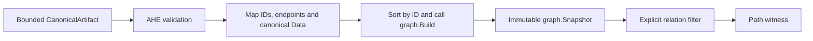
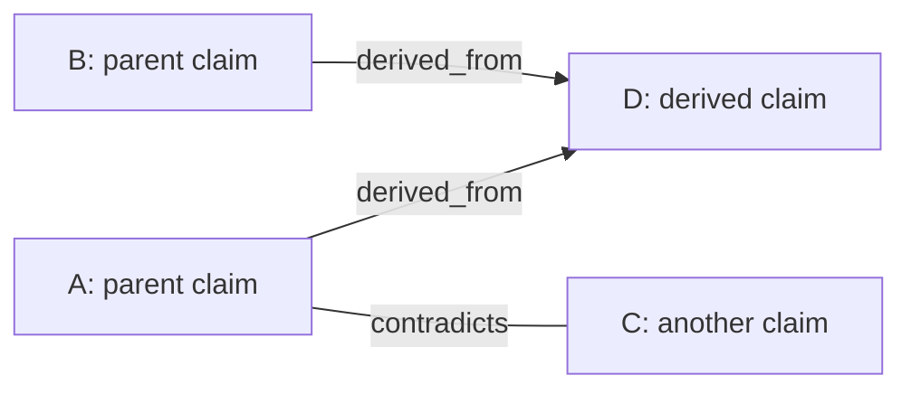
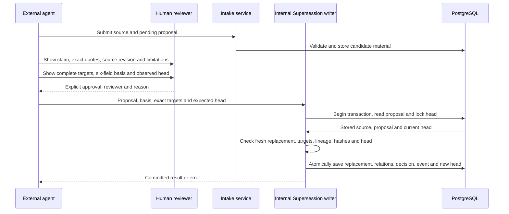
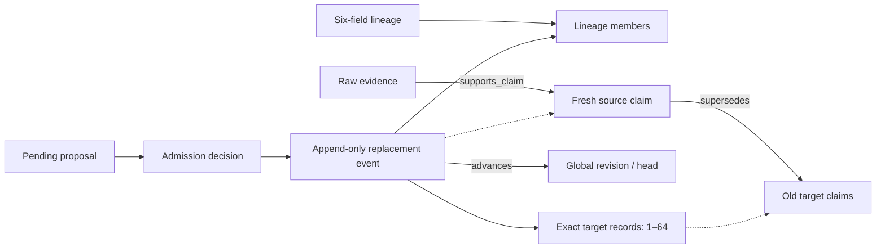
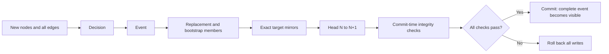
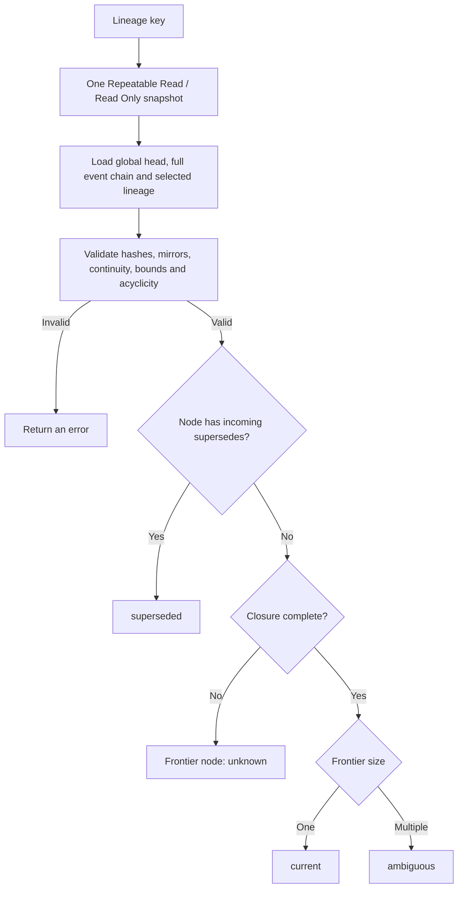
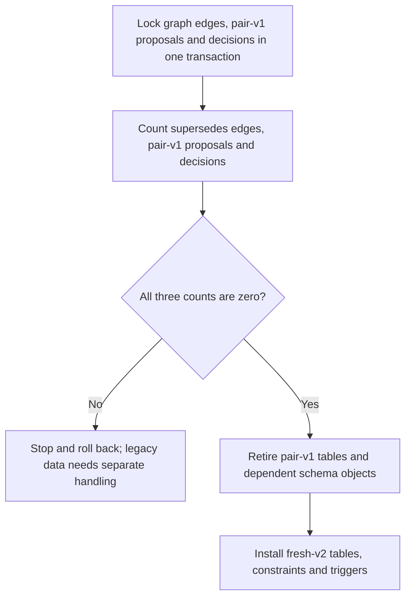

# AHE System Design

This document describes current data structures, algorithms and theoretical boundaries.
See [INSTALL](../INSTALL.md) for installation and permissions, and [README](../README.md)
for product entry points. It describes product contracts; internal plans and experiment
progress are not current capabilities. Historical experiment logs, reviews and raw
measurements are not product documentation. This document is not proof of deployment
readiness or model quality.

## Contents

- [System responsibilities](#architecture)
- [Data model and identity](#data-model)
- [Review and state transitions](#review)
- [Graph relations and versions](#graph)
- [Text search](#search)
- [Runtime authority and integrity](#authority)
- [References](#references)

<a id="architecture"></a>

## System responsibilities

```text
Data source / source MCP → external client → Intake MCP → sources, extraction records, pending
                                           ↓
                             exact review subject → human decision
                                           ↓
                                    Review MCP → PostgreSQL
                                           ↑
External client / downstream agent ← read-only evidence package ← Query MCP
```

- **External client** connects to sources, preserves original content, runs model extraction
  and provides the human workflow. Source collection stays outside Core.
- **MCP domain / PostgreSQL** stores source identity, proposals, review decisions and
  the canonical graph. Model output does not authorize writes.
- **Query** retrieves material with scope, status and citations. It does not produce
  factual conclusions for the user.
- **Topology kernel** handles nodes, edges and structural algorithms. AHE defines
  the evidence meaning, temporal semantics and admission rules of relations.

External clients communicate through separately authorized MCP processes.
Collected sources, pending proposals, admitted canonical evidence, active repository
generations and downstream answers remain distinct states or layers.

<a id="data-model"></a>

## Data model and identity

### Sources and candidates

| Structure | Stores | Does not establish |
| --- | --- | --- |
| `source_blobs` | Original content and content hashes | Source truth or trustworthiness |
| `source_snapshots` | Source objects, revisions and metadata | Whether a revision is still the latest at the provider |
| `extraction_views` | Renderer/version, rendered body and hash | Permission to replace original content with a model summary |
| `span_catalog_entries` | Exact byte ranges, line numbers, citations and hashes within a view | Support for arbitrary claims |
| `extraction_runs` / `extraction_attempts` | Source, extractor definition, attempt status and output identity | Acceptable model semantic quality |
| `proposal_batches` / `proposal_occurrences` | Candidate sets from one output and their claims | Admission approval |
| External source request/receipt | Binding between a delivery and its stored source | Independent sources merely because there were multiple deliveries |

Raw bytes, rendered views, exact quotes and claims are stored separately. Cleaning or
rendering must retain the renderer and source relationship; a model summary must not
overwrite original evidence. Multiple quotes from one document are not automatically
independent support.

External sources use provider object identity and revision. Content or source metadata
changes under the same revision cause a conflict. The external envelope requires
`content_fidelity=verbatim`. `exact_excerpt` and `truncated_document` require stated
limitations; `full_document` requires empty `limitations`. This submission contract does
not externally certify provider identity or completeness.

Source delivery requests and extraction requests use separate namespaces. Reusing an
extraction request requires the same source, view and extractor definition. Different
inputs require a new request. Identical output can be replayed; changed output cannot
append another candidate set. `producer_session_ref` is an audit annotation, not a
replacement for semantic identity. A successful output with zero candidates is abstention.
A late failure can only move `started` to `failed`; it cannot overwrite a committed terminal state.

### Canonical graph

`CanonicalArtifact` is a portable, bounded representation containing nodes, edges,
payloads, provenance, temporal data, integrity and derivations. It is not another
authoritative persistent database.

- Node kinds: `raw_evidence`, `source_claim`, `derived_claim`, `candidate`.
- Edges contain `from`, `to`, a relation and a provenance reference.
- Payloads separately retain source content/location, claims, scope and target anchors.
  A title is not complete evidence.
- Temporal records and Supersession currentness differ. Currentness is a projection
  computed at query time.
- A derivation records the complete parent set as an **AND dependency**; one parent
  alone is not sufficient.

The existence of a type does not mean a standard MCP writer can create it.
See [canonical.go](../internal/evidencegraph/canonical.go) for types,
[external_source.go](../internal/evidenceingestion/external_source.go) for source
contracts, and [migrations](../migrations) for persistence constraints.

<a id="review"></a>

## Review and state transitions

| Human decision | Stored result | Canonical effect |
| --- | --- | --- |
| Defer | Remains `pending`; not a writer outcome | None |
| `admit` | `admitted` decision and exact-review binding | Atomically creates or verifies canonical materialization eligible for reuse |
| `reject` | `rejected` terminal state and review reason | No canonical nodes or edges created |
| `audit_only` | `audit_only` terminal state and review reason | No canonical nodes or edges created |

The exact-review binding chain is manifest → submission receipt → proposal basis →
review package → displayed subject. The displayed text is bound too; checking only a
proposal ID is insufficient. The review getter accepts only pending proposals. In one
Repeatable Read transaction, the writer locks the proposal, rebuilds the subject and
checks the complete display before atomically storing the decision and any corresponding
materialization. Seeing a review package grants no approval authority to Intake, Query or a model.

Replay must preserve the original outcome, subject, extraction attempt, principal and
reason. Changing a reason, quote or ID is not recovery. An uncertain response does not
mean the remote transaction rolled back. Terminal-state retries use the original writer
request and do not require a new pending review.

Ordinary source-backed admission creates `raw_evidence → source_claim` through
`supports_claim`. The mutation manifest, node/edge binding and first-materializer identity
constrain reuse and exact replay. Different content or relations under the same ID must
be rejected rather than overwrite existing evidence. The DB records who admitted a claim
and why; it does not prove that the person read the display or that the claim is true.

Implementation: [review contract](../internal/evidenceingestion/reviewable_ingestion.go),
[display binding](../internal/evidenceingestion/reviewable_ingestion_display.go),
[admission](../internal/evidenceingestion/reviewable_ingestion_admission.go),
[disposition](../internal/evidenceingestion/reviewable_ingestion_disposition.go).

<a id="graph"></a>

## Graph relations and versions

### Structural algorithms are not evidence inference

| Relation | Meaning/direction |
| --- | --- |
| `supports_claim` | Raw evidence → source claim |
| `derived_from` | In this implementation, parent → derived target; the complete parent manifest expresses the AND dependency |
| `contradicts` | Symmetric; sorted endpoints identify the same node pair |
| `supersedes` | New replacement → old target |
| `references` / `implements` | Typed reference/implementation relations; similarity or arbitrary edge writes alone cannot establish them |

Independent relation admission uses a dedicated MCP profile, separate from node
review. The native writer reloads endpoint authority, verifies the exact review
subject and launcher-bound approval, and atomically stores one directed edge
with an append-only `canonical_implements_admissions` or
`canonical_references_admissions` receipt. Query relation provenance includes
that receipt. Exact retries reuse request identity; changed approval data or
stale subjects conflict. Adding independently receipted edges does not alter
the original node-admission manifest: replay excludes only verified independent
relations, not arbitrary edges carrying a matching label.

The exposed `implements` profile requires a derived specification and
repository-backed Go source claim. Its complete recursive AND ancestry is
bounded to 8 derived layers, 64 nodes and 128 parent edges; every derived layer
has an explicit reviewed rule. Code is reconstructed from its retained revision
and parser-backed source, not from a model summary. Only the reviewed root-to-code
edge is admitted; no transitive implementation, execution or correctness is
inferred. Direct source-specification and endpoint-creation writers are not
exposed by this profile.

`references` v1 resolves literal source reference and anchor markers, locally
or against a pinned snapshot. It retains a complete bounded observed overlap
set (1–64 candidates) and requires a unique target for a fresh admission.
Historical replay uses the recorded cut, not today's overlap set. Reference
cycles are permitted; receipt checks do not recursively infer support.
Qualified external-source authority is required by the native path; arbitrary
URLs, provider links and manual-review-profile admission are not supported.

Product migrations 47–48 preserve the product's existing ordinary and
Supersession authority contracts while adding these independent receipts.
Startup verifies receipt columns, constraints, guarded functions and triggers;
role policy v7 permits relation-reviewer INSERT only on the edge and two receipt
tables. Trusted role credentials still do not authenticate a human conversation.

The graph adapter obtains AHE-selected relations and a bounded scope from one read
snapshot, then passes them to general topology algorithms. A path proves only structural
connectivity within that view. A cycle, SCC or contradiction component does not automatically
prove a semantic contradiction, nor that every pair in the component contradicts each other.
Checks requiring a DAG must name the relation; the full evidence graph is not assumed acyclic.
Process-local read-view handles bind the principal and DB/schema/role. They must be reopened
after eviction or process restart. A bounded ReadView is not a complete global graph.

### Graph adapter example

The adapter maps AHE records to the generic graph kernel without changing their IDs
or relations. It sorts nodes and edges by ID, then calls `graph.Build` to create a
snapshot. Canonical records remain in each graph node/edge's `Data` field. The relation
filter is applied when an algorithm reads that snapshot.


```mermaid
flowchart LR
    A["Bounded CanonicalArtifact"] --> V["AHE validation"]
    V --> M["Map IDs, endpoints and canonical Data"]
    M --> S["Sort by ID and call graph.Build"]
    S --> G["Immutable graph.Snapshot"]
    G --> F["Explicit relation filter"]
    F --> P["Path witness"]
```

For example, suppose a complete artifact contains these synthetic relations:


```mermaid
flowchart LR
    A["A: parent claim"] -->|derived_from| D["D: derived claim"]
    B["B: parent claim"] -->|derived_from| D
    A ---|contradicts| C["C: another claim"]
```

The following helper runs inside this repository's Go module because it imports
`internal` packages. Its input is a complete `CanonicalArtifact`, including the
payload, provenance, temporal, integrity and derivation records required by validation.
An edge-only diagram is not enough to construct that artifact. A bounded PostgreSQL
read supplies `CanonicalReadView.Artifact`; its scope and `Truncated` flag must remain
part of the caller's interpretation.

```go
package graphexample

import (
	"github.com/Yui-Qi-Tang/ahe-mcp/internal/evidencegraph"
	"github.com/Yui-Qi-Tang/ahe-mcp/internal/evidenceprojection"
)

// FindDerivedPath finds one directed path using only derived_from edges.
func FindDerivedPath(
	artifact evidencegraph.CanonicalArtifact,
	from, to string,
) (evidenceprojection.PathWitness, error) {
	topology, err := evidenceprojection.PrepareTopology(artifact)
	if err != nil {
		return evidenceprojection.PathWitness{}, err
	}
	return topology.FindPath(evidenceprojection.PathQuery{
		FromNodeID: from,
		ToNodeID:   to,
		Relations: []evidencegraph.CanonicalEdgeRelation{
			evidencegraph.CanonicalDerivedFrom,
		},
	})
}
```

| Query in this example | Result |
| --- | --- |
| A to D, `derived_from` only | `Found=true`, path A → D |
| A to C, `derived_from` only | `Found=false`; the contradiction edge is excluded |
| D to A, `derived_from` only | `Found=false`; derived edges keep their direction |
| A to C, `contradicts` only | `Found=true`; use `CanonicalContradicts` in `Relations` |

The A → D path does not establish that A alone supports D: D's complete derivation
still requires both A and B. The witness reports connectivity within this view and
does not admit evidence or change PostgreSQL. The adapter and `graph` types remain
private to `evidenceprojection`; callers use AHE's `PreparedTopology` and `PathWitness`.
See [adapter](../internal/evidenceprojection/topology.go),
[path API](../internal/evidenceprojection/topology_algorithms.go) and
[relation-scope tests](../internal/evidenceprojection/topology_algorithms_test.go).

### Exact endpoint admission

`repository-intake` fixes repository root/identity in its launcher, captures
immutable tracked Go bytes and parses pending proposals into an inactive
generation. Git transports and inherited Git authority are disabled. It never
runs code, builds dependencies, invokes a model or admits evidence.

`endpoint-reviewer` accepts only `repository_code` and `derived_spec`.
Code is checked against original file bytes, commit/blob/path, offsets, line
numbers, parser fact and fingerprint. A derived specification starts with an
original-source-backed proposal plus explicit complete AND parents, method,
producer and trace. Recursive parents use the same bounded native origin
checks as `implements`; exact quotations remain separate from the proposed
derived statement. This is not semantic entailment verification.

The digest binds the complete deterministic display and requested effect.
The review response keeps current DB `lifecycle` separate from that immutable
pre-admission `display`. `pending_admission` denotes a new review;
`exact_replay_only` reports an admitted canonical ID and its original endpoint
receipt. The latter requires the same reconstructed subject, valid endpoint
binding and persisted ordinary admission. A proposal admitted through another
path without an endpoint receipt is refused, not presented as pending.
Lifecycle is not part of the subject, so existing displays and receipts retain
their hashes; its presence never authorizes a new decision or changed replay.
Admission rebuilds it under repeatable read, locks the proposal and retains
native derivation/cycle checks. A schema-pinned definer helper obtains the
original `FOR KEY SHARE` locks on up to nine node IDs without granting canonical
UPDATE; the native writer retains its original lock path. The helper cannot
select a schema or mutate evidence, and all other helper EXECUTE remains denied.

The endpoint, support/AND edges, ordinary manifest and immutable
`canonical_endpoint_review_bindings` receipt commit atomically. Receipts bind
proposal, display, request ID, reviewer, reason and result; exact replay and
relation-origin checks retain ordinary authority. Query exposes
`endpoint_admission`; search algorithms and ranking are unchanged. Endpoint
and relation approvals remain independent.

### Implemented internal domain contracts

The domain registry is broader than the standard runtime. Only the bounded
exact-reviewed endpoint subset above is exposed; generic derived, contradiction
and Supersession writers remain disabled. Do not bypass the entry point with
`source-claim-reviewer` credentials or treat these internal paths as enabled client operations.

- **Derived admission**: each new immutable derived claim requires 1–64 admitted
  direct parents and the complete exact `parent → target` edges. Go admission validation
  enforces this parent-count limit; the database schema does not enforce the same
  64-parent limit. Transactional locks and cycle preflight validate the set; loose
  binary edges do not establish required premises.
- **Candidate recording**: the internal admission API can record a hypothesis with
  complete parents as `candidate`. Recording it does not establish the claim;
  proposition binding and promotion through a derived-claim parent reject candidates.
- **Contradiction**: create a complete proposal before approval. Node-pair identity is
  single-use, including `rejected` and `audit_only` terminal states. Changing the rationale
  does not create a new version. Do not duplicate nodes to bypass this rule.
  The internal API optionally binds an independent source proposal whose statement
  exactly matches the rationale. Query reads its quoted source alongside both
  endpoints in the same transaction. This preserves relation provenance, not proof
  of semantic correctness. Existing proposals without that source retain their identity.
- **Supersession**: approve a new external-source pending proposal, fresh replacement,
  complete targets and head conditions together. Provider revision order does not
  automatically create a replacement relation.

See [admission](../internal/evidenceingestion/admission.go),
[contradiction](../internal/evidenceingestion/canonical_contradiction.go),
[supersession admission](../internal/evidenceingestion/supersession_admission.go).

### Supersession review flow

This diagram describes the internal Supersession domain workflow. The standard
ingestion runtime does not expose its writer.


```mermaid
sequenceDiagram
    participant A as External agent
    participant H as Human reviewer
    participant I as Intake service
    participant W as Internal Supersession writer
    participant P as PostgreSQL
    A->>I: Submit source and pending proposal
    I->>P: Validate and store candidate material
    A->>H: Show claim, exact quotes, source revision and limitations
    A->>H: Show complete targets, six-field basis and observed head
    H-->>A: Explicit approval, reviewer and reason
    A->>W: Proposal, basis, exact targets and expected head
    W->>P: Begin transaction, read proposal and lock head
    P-->>W: Stored source, proposal and current head
    W->>W: Check fresh replacement, targets, lineage, hashes and head
    W->>P: Atomically save replacement, relations, decision, event and new head
    W-->>A: Committed result or error
```

### Supersession: lineage, CAS and immutable history

Six basis fields define lineage: `source_system`, `source_namespace`, `object_type`,
`object_id`, `slot_kind`, `slot_id`. The first four must match the stored source; the
last two are reviewed declarations of a stable semantic slot. Content, provider revision,
time, model and session are not part of lineage identity. Identical content does not imply
identical lineage.

The database schema enforces 1–64 targets per Supersession event, limiting each
replacement to 64 `supersedes` relations. Each replacement creates a fresh source claim,
`new → old` edges, an append-only event, member/target mirrors, a decision and a new head. The entire
set must be atomic in one transaction. Partial admission and later target additions are
not allowed. Bootstrap registers existing admitted claims that meet source-object
conditions as old members; it does not recreate or review those nodes again.

All lineages share one global revision/head. A command supplies the expected revision
and head event ID it read. After locking the head, the command checks them again and
advances N to N+1 only on a match. This is a database serialization point, not provider
time or a multi-node consensus protocol. Request/decision/event hashes bind their complete
semantics; differences cannot be treated as exact replay. PostgreSQL constraints and
deferred triggers check relational mirrors, append-only history and head progression.
The Go domain recomputes semantic hashes; these are not two independently editable
JSON canonicalization schemes.

The stored relationships are:


```mermaid
flowchart LR
    P["Pending proposal"] --> D["Admission decision"]
    D --> E["Append-only replacement event"]
    L["Six-field lineage"] --> M["Lineage members"]
    E --> M
    E --> T["Exact target records: 1–64"]
    E -->|advances| H["Global revision / head"]
    R["Raw evidence"] -->|supports_claim| N["Fresh source claim"]
    N -->|supersedes| O["Old target claims"]
    T -.-> O
    E -.-> N
```

All writes belong to the same transaction:


```mermaid
flowchart LR
    G["New nodes and all edges"] --> D["Decision"]
    D --> E["Event"]
    E --> M["Replacement and bootstrap members"]
    M --> T["Exact target mirrors"]
    T --> H["Head N to N+1"]
    H --> C["Commit-time integrity checks"]
    C --> V{"All checks pass?"}
    V -->|Yes| A["Commit: complete event becomes visible"]
    V -->|No| R["Roll back all writes"]
```

### Currentness: what one snapshot can establish

The read-only loader reads the head, complete global event chain, selected lineage
members/edges/targets and claims for the same object. It checks hashes, continuity,
acyclicity and classification completeness, then computes the frontier of nodes with no
incoming `supersedes`. Status is per node: nodes with valid incoming `supersedes` remain
`superseded`. Only the remaining frontier nodes are classified by closure completeness
and frontier size; not all nodes become `current` or `unknown` together.

| Result | Condition |
| --- | --- |
| `superseded` | A valid incoming `supersedes` exists |
| `current` | Complete closure with one frontier node |
| `ambiguous` | Complete closure with multiple frontier nodes |
| `unknown` | Unclassified claims for the same object prevent proof of frontier completeness |

Corrupt structures, missing events, hash/mirror mismatches, cycles and exceeded limits
return errors, not `unknown`. Current hard limits: 10,000 global events, 10,000 lineage
members, 100,000 lineage edges and 50,000 object claims. A witness binds the snapshot;
it is not a signed certificate. `current` does not mean latest at the provider or true
in the real world. Query accepts only the lineage key, not caller-declared winners,
members or completeness.


```mermaid
flowchart TD
    Q["Lineage key"] --> R["One Repeatable Read / Read Only snapshot"]
    R --> L["Load global head, full event chain and selected lineage"]
    L --> V["Validate hashes, mirrors, continuity, bounds and acyclicity"]
    V -->|Invalid| E["Return an error"]
    V -->|Valid| N{"Node has incoming supersedes?"}
    N -->|Yes| S["superseded"]
    N -->|No| C{"Closure complete?"}
    C -->|No| U["Frontier node: unknown"]
    C -->|Yes| F{"Frontier size"}
    F -->|One| X["current"]
    F -->|Multiple| B["ambiguous"]
```

See [lineage / event](../internal/evidencesupersession/supersession.go),
[closure / currentness](../internal/evidencesupersession/closure.go).
Migration 42 retires pair-v1 without guessing old data: nonempty existing pair authority
stops the migration. Old edges cannot stand in for fresh-v2 history.


```mermaid
flowchart TD
    L["Lock graph edges, pair-v1 proposals and decisions in one transaction"]
    L --> C["Count supersedes edges, pair-v1 proposals and decisions"]
    C --> Z{"All three counts are zero?"}
    Z -->|No| F["Stop and roll back; legacy data needs separate handling"]
    Z -->|Yes| D["Retire pair-v1 tables and dependent schema objects"]
    D --> V["Install fresh-v2 tables, constraints and triggers"]
```

<a id="search"></a>

## Core record history

Migrations 50–52 add storage contracts independent of admission and evidence selection.
Migration 53 adds immutable consistency watch versions, runs, proof artifacts and
per-watch notifications. Migration 54 tightens integer-token and configured-event
integrity checks without adding tables or changing policy v7. Configuration
writes and workers use separate locks, allowing a new version during solving.
The native worker applies an explicit currentness policy,
localizes one contradictory condition set and recomputes changed snapshots.
The `ahe-consistency-worker` command requires explicit startup and database role
policy v7. Query exposes five consistency read tools; core-records appends watch configuration
with a launcher-bound recorder. Neither endpoint executes semantic extraction or
admission. See [product operation](CONSISTENCY.md) and
[consistency contracts](../internal/evidenceingestion/CONSISTENCY.md).
The four-field proposition identity (namespace, local ID, scope, definition revision)
is assigned externally. Length-framed identity preserves exact field boundaries;
Core never infers synonymy. Initial membership and correction/withdrawal/restoration
are separate immutable records. Changes lock the membership row and compare the
expected revision, previous reference and previous identity. Competing changes
cannot both claim one next revision; the winner is not a semantic verdict.

Read current state explicitly (`revision=-1`), initial state (`0`), or an event
revision. Replaying an old request returns its historical receipt. Current member
lookup distinguishes no event from an event with a null target, so a withdrawn
binding does not fall back to its original identity. Event-list truncation does
not alter the selected state. Current members and their bounded graph share one
PostgreSQL snapshot; neighbouring graph nodes are not additional members.

If conclusion E originally uses D, subsequently correcting D's proposition label
does not rewrite D, E or E's parents. Read original nodes/statements and the desired
binding revision separately. This interface does not provide whole-graph time travel.

External checks retain source/proposal coordinates, named checker/version/config,
claimed actual materials, per-dimension findings, limitations and revision links.
Verbatim inputs must equal authoritative stored text. Other formats and checker
results remain external assertions. No aggregate PASS, admission or latest winner
is generated. The MCP recorder is launcher-bound; claimed checker identity is not.

External representations preserve exact JSON text (including numeric literals),
format/producer, authenticated MCP recorder, declared dependencies and previous
version. Duplicate keys and unresolved JSON pointers are rejected. A dependency
key contains exactly namespace/local_id/scope_ref/revision, including in direct
SQL. `supplied` records a linked source snapshot/view/hash, not semantic satisfaction.
Changing supply state requires a new representation; old checks stay historical.

A check-to-representation link accepts only the complete exact envelope already
present as that check's input. Storing a check and indexing the link are separate
transactions. Dependency reverse lookup returns only registered representations
and explicitly linked inputs for those returned representations; inspect both
truncation flags. Unregistered users are not inferred. JSON scanning is not yet
qualified at large scale; the returned limit does not bound all database work.

The `core-records` role appends only these records. Existing profiles receive read
access, not record writes. Query uses the same database/schema visibility boundary
as its other tools. Database constraints enforce structural preservation, while
recorder authentication is enforced by the protected MCP/Go entry point. Holders
of raw writer credentials remain trusted; SQL audit names alone are not identity
proof. Neither record acceptance nor structural validation proves source fidelity.

## Text search

Search separates candidate eligibility from candidate ranking. Neither determines truth.
`search_evidence_records` retains exact lexical lookup. The modes below are options for
grounded brief; their defaults are not interchangeable.

| `query_mode` | Method |
| --- | --- |
| `exact_lexical` | Matches all terms in the statement after PostgreSQL `simple` normalization; not raw-byte equality |
| `deterministic_lexical_recovery` | Grounded brief default; records the simple attempt, then uses English morphology. Only if results remain empty and English yields at least 3 terms does it relax to at least 2 overlapping terms |
| `experimental_han_lexical_recovery_v1` | Adds literal Han all-term matching only after recovery-v2 ends with zero results; mixed ASCII follows separate rules |
| `experimental_multisurface_lexical_v1` | Research mode; unions baseline candidates with statement/bounded-source-body candidates |
| `practical_multisurface_lexical_v1` | Explicit practical query mode; conditional zero-hit expansion and restrictions on auxiliary Han terms |

A `simple` match does not stop recovery-v2 early; English morphology still runs.
Literal Han fallback and multisurface bigrams are different algorithms. Neither is a
general Chinese word segmenter, translator or semantic inference engine.

### Practical multisurface plan v2

1. Convert consecutive Han characters into overlapping bigrams. Normalize other text
   with PostgreSQL English and retain the original query.
2. Retain baseline candidates. The English threshold for statements and source bodies
   is `min(2, term count)`; Han adds candidates under its eligibility policy.
3. Fixed auxiliary fragments meaning "affect", "cause", "whether" and "how" cannot
   trigger supplemental Han matches alone. An explicit broad-search exception remains
   for queries containing only auxiliary Han fragments and no English terms. This is
   not semantic topic recognition.
4. Retry with one English term only if the first pass is completely empty, English
   terms exist, the baseline is not truncated and no source was excluded by a limit.
   Nonempty results, errors, cancellation and exceeded data limits do not trigger expansion.
5. SQL applies eligibility before sorting and limit. Sort by distinct matched-term
   count descending, creation time descending, then ID ascending. Original terms still
   explain and score matches; source wording and candidate quotes are not changed.

The practical mode name remains v1, its plan is `practical-multisurface-lexical-v2`,
and its response is `grounded-evidence-brief-v7`. These versions identify different
contracts. The client explicitly selects the mode/schema and reports incompatibility
instead of silently falling back. Research v6 remains a separate mode. Fixed-case results
are not a general quality guarantee.

### Scope and limits

- Full-source expansion covers only `manual_text` / `manual-text-identity/v1`, not all
  external-document renderers.
- Source views are limited to 1 MiB and 4,096 spans; each span is limited to 8,192 bytes.
  Exclusions are explicit and do not support a claim of exhaustive search.
- Each source returns at most 8 matching spans, with explicit truncation beyond that.
  `within_proposal_source_refs` distinguishes recovered context from original proposal
  citations without changing the proposal.
- Queries allow at most 256 Unicode characters and 16 whitespace-separated terms;
  result limit is at most 100. Expansion cannot broaden filters or visibility.
- Each evidence query uses one Repeatable Read / Read Only snapshot. Timeout and
  integrity failures return errors, not false empty sets.
- There is no vector search, model query rewrite or semantic entailment check. Zero
  hits mean nothing was found within this request's scope and rules.

Code: [query modes](../internal/evidenceingestion/query_execution.go),
[lexical recovery](../internal/evidenceingestion/query_recovery.go),
[Han fallback](../internal/evidenceingestion/query_han_recovery.go),
[multisurface](../internal/evidenceingestion/query_multisurface.go),
[source bounds](../internal/evidenceingestion/source_view_bounded.go).
See [search references](#search-references) for background. Current ranking does not
implement BM25, PathSim or a paper's scoring model.

<a id="authority"></a>

## Runtime authority and integrity

| Program/profile | Current public scope |
| --- | --- |
| Query | 13 read-only tools; no model calls or evidence writes |
| Intake | 5 source/extractor tools; source/extraction/pending only |
| `source-claim-reviewer` | 3 exact source-review tools; admit/reject/audit_only |
| `relation-reviewer` | 4 exact implementation/reference review/admission tools; no node writes |
| `repository-intake` | 2 fixed-repository capture/parser tools; pending and inactive generations |
| `endpoint-reviewer` | 2 exact endpoint review/admission tools; no collection or independent relations |
| `legacy-reviewer` / `legacy-operator` | CLI rejects startup; the internal 43-tool registry is not a public capability list |

Runtime `tools/list` is the interface authority. Tool arguments cannot switch schema,
DB role or reviewer principal. Separate LOGIN/NOLOGIN roles, fixed launchers and checks
on each connection/reuse constrain runtime authority. Query visibility covers the selected
schema, not row-level tenant isolation. Reviewer table ACLs still permit trusted raw DML;
ACLs alone do not prove that all direct SQL passes exact review. DB owners/superusers
remain within the trusted operations boundary.

MCP has its own migration ledger, currently through 48. Same-numbered migrations from
another Core repository cannot be applied directly. Migration/runtime checks cover names,
checksums and protected schema objects. Failures do not automatically delete data or
relax ACLs. Legacy data conversion, persistent DB deployment and service-role provisioning
require separate operational authorization.

See [runtime profile gate](../cmd/ahe-ingest-mcp/main.go),
[ingestion authorization](../internal/mcpadmin/authorization.go),
[query authorization](../internal/mcpquery/authorization.go), [role policy](../internal/dbrole).
Installation steps are in [INSTALL](../INSTALL.md#runtime-role-provisioning-gate);
this design document does not replace operational checks.

<a id="references"></a>

## References

These sources are traceable to existing AHE design and research records.
Papers, textbooks, specifications and external engineering methods are identified separately.
They provide design background, not implemented features or formal proof of AHE.
No papers are invented for theoretical keywords without a specific bibliographic source.

<a id="extraction-references"></a>

### Extraction, citations and readability

- Alexander Fabbri, Chien-Sheng Wu, Wenhao Liu, Caiming Xiong (2022),
  [QAFactEval: Improved QA-Based Factual Consistency Evaluation for Summarization](https://aclanthology.org/2022.naacl-main.187/), NAACL.
  Background on summary/source consistency; its training pipeline and scorer are not used.
- James Thorne, Andreas Vlachos, Christos Christodoulopoulos, Arpit Mittal (2018),
  [FEVER: a Large-scale Dataset for Fact Extraction and VERification](https://aclanthology.org/N18-1074/), NAACL.
  Separates claims, evidence and insufficient information. FEVER labels are not AHE admission outcomes.
- Jay DeYoung et al. (2020), [ERASER: A Benchmark to Evaluate Rationalized NLP Models](https://aclanthology.org/2020.acl-main.408/), ACL.
  Distinguishes human-readable rationales from faithfulness to model predictions.
  ERASER sufficiency/comprehensiveness scoring is not implemented.
- Shi Feng et al. (2018), [Pathologies of Neural Models Make Interpretations Difficult](https://aclanthology.org/D18-1407/), EMNLP.
  High model confidence after input reduction does not prove the remaining text is readable
  or sufficient. AHE chooses to preserve human-readable context; it does not use their fine-tuning method.

<a id="search-references"></a>

### Search and ranking

- Christopher D. Manning, Prabhakar Raghavan, Hinrich Schütze (2008), textbook *Introduction to Information Retrieval*:
  [Chapter 6: Scoring, term weighting and the vector space model](https://nlp.stanford.edu/IR-book/html/htmledition/scoring-term-weighting-and-the-vector-space-model-1.html),
  [Inverse document frequency](https://nlp.stanford.edu/IR-book/html/htmledition/inverse-document-frequency-1.html).
  Separates candidate matching from ranking. Rare-term weights establish neither evidence
  truth nor semantic conditions that must match.
- Kalervo Järvelin, Jaana Kekäläinen (2002), [Cumulated Gain-based Evaluation of IR Techniques](https://doi.org/10.1145/582415.582418), ACM TOIS 20(4), 422–446.
  Background for graded relevance and nDCG in historical ranking research, not runtime confidence scores.
- Ellen M. Voorhees (2003), [Evaluating the Evaluation: A Case Study Using the TREC 2002 Question Answering Track](https://aclanthology.org/N03-1034/), HLT-NAACL, 260–267.
  Background for historical reciprocal-rank evaluation. A useful first result does not imply complete coverage.
- Richard Sproat, Thomas Emerson (2003), [The First International Chinese Word Segmentation Bakeoff](https://aclanthology.org/W03-1719/), SIGHAN.
  Background on differing Chinese segmentation standards. Han character matching is not
  claimed to implement a segmenter for this benchmark.

### Graph relations, versions and consistency

- Andrian Marcus, Jonathan I. Maletic (2003), [Recovering Documentation-to-Source-Code Traceability Links using Latent Semantic Indexing](https://ieeexplore.ieee.org/abstract/document/1201194/), ICSE, DOI `10.1109/ICSE.2003.1201194`.
  Background for document/code traceability candidates. Similarity does not automatically authorize `implements`.
- Yizhou Sun, Jiawei Han, Xifeng Yan, Philip S. Yu, Tianyi Wu (2011), [PathSim: Meta Path-Based Top-K Similarity Search in Heterogeneous Information Networks](https://www.vldb.org/pvldb/vol4/p992-sun.pdf), PVLDB 4(11).
  Historical heterogeneous-graph path research. PathSim is not implemented, and its symmetric
  same-type formula is not directly used as a criterion for directed `implements`.
- Maurice P. Herlihy, Jeannette M. Wing (1990), [Linearizability: A Correctness Condition for Concurrent Objects](https://www.cs.cmu.edu/~wing/publications/HerlihyWing90.pdf), ACM TOPLAS 12(3), 463–492.
  Specification background for concurrent operations and legal sequential histories,
  not a claim of a complete AHE linearizability proof.

### Admission theory not yet implemented

- Paul H. Morris, Robert A. Nado (1986), [Representing Actions with an Assumption-Based Truth Maintenance System](https://cdn.aaai.org/AAAI/1986/AAAI86-003.pdf), AAAI.
  Background on multiple assumption environments and support sets. ATMS is not implemented;
  removing one support does not remove other independent support.
- Akhil A. Dixit, Phokion G. Kolaitis (2021), [Consistent Answers of Aggregation Queries using SAT Solvers](https://arxiv.org/pdf/2103.03314v3), arXiv:2103.03314v3.
  Research on repairs and consistent answers under specified integrity constraints.
  AggCAvSAT and SAT-based aggregate queries are not implemented.
- Alexandra Meliou, Wolfgang Gatterbauer, Katherine F. Moore, Dan Suciu (2010), [The Complexity of Causality and Responsibility for Query Answers and non-Answers](https://homes.cs.washington.edu/~suciu/file22_main.pdf), PVLDB 4(1).
  Distinguishes query lineage from causal responsibility. AHE dependency edges are not
  causal proof, and AHE does not compute responsibility scores.

### Formal specifications and engineering methods

- W3C PROV (2013): [Overview](https://www.w3.org/TR/prov-overview/), [PROV-DM](https://www.w3.org/TR/prov-dm/), [PROV-CONSTRAINTS](https://www.w3.org/TR/prov-constraints/).
  Conceptual background for source entities, activities, producers and derivation.
  Full PROV compliance is not claimed; `supports_claim` is not directly equivalent to `wasDerivedFrom`.
- IETF RFC 9110 (2022): [Entity Tags §8.8.3](https://www.rfc-editor.org/rfc/rfc9110.html#section-8.8.3), [If-Match §13.1.1](https://www.rfc-editor.org/rfc/rfc9110.html#section-13.1.1).
  Opaque version identifiers and expected-version conditions. Opaque revisions do not imply order or lineage.
- Unicode UAX #29, Revision 47: [Unicode Text Segmentation](https://www.unicode.org/reports/tr29/tr29-47.html).
  Specification background for text boundaries and language-specific tailoring.
  AHE does not claim a complete segmenter for this revision.
- Clark Barrett, Pascal Fontaine, Cesare Tinelli, [The SMT-LIB Standard, Version 2.7, 2025-07-07](https://smt-lib.org/papers/smt-lib-reference-v2.7-r2025-07-07.pdf).
  Historical formal-consistency research. The product evidence path uses SAT; the
  generic resolver has a separate bounded SMT adapter. An unsat core
  does not determine natural-language facts.
- PostgreSQL 18 documentation: [Full-text search](https://www.postgresql.org/docs/18/textsearch-controls.html), [Transaction isolation](https://www.postgresql.org/docs/18/transaction-iso.html),
  [`ON CONFLICT`](https://www.postgresql.org/docs/18/sql-insert.html#SQL-ON-CONFLICT),
  [`SECURITY DEFINER`](https://www.postgresql.org/docs/18/sql-createfunction.html#SQL-CREATEFUNCTION-SECURITY), [prepared statements](https://www.postgresql.org/docs/18/sql-prepare.html).
  Database references for search, transactions and replay. Database mechanisms alone
  do not prove application-protocol correctness.
